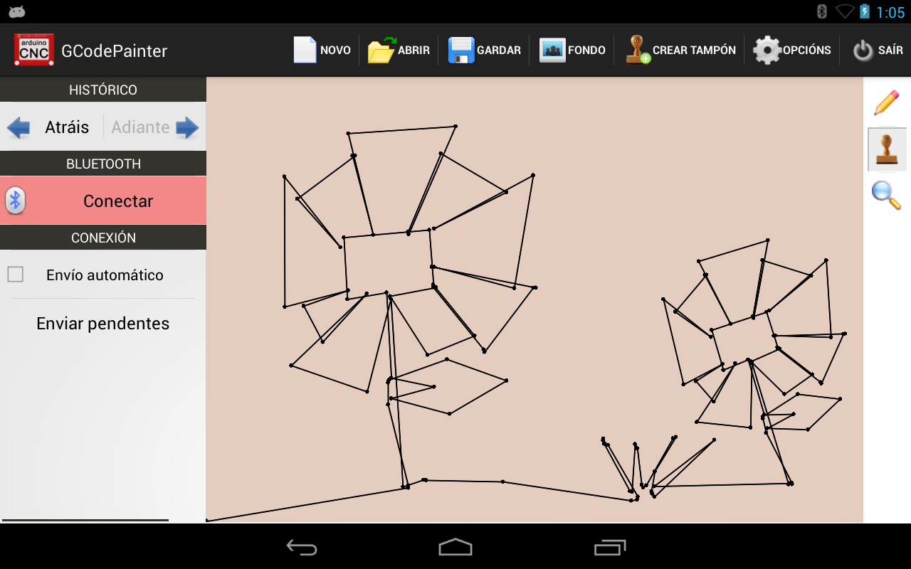

AndroidGCodePainter
===================
This app allows you to draw on the tablet touch screen and generates the corresponding GCode to print it on a CNC machine directly over bluetooth.
You can see a working example here: http://www.youtube.com/watch?v=dBtlcxkml6k 

It was thought to be used with this project: https://github.com/santicastro/ArduinoEtchASketch

This project depends on this one: https://github.com/santicastro/Android-utils

